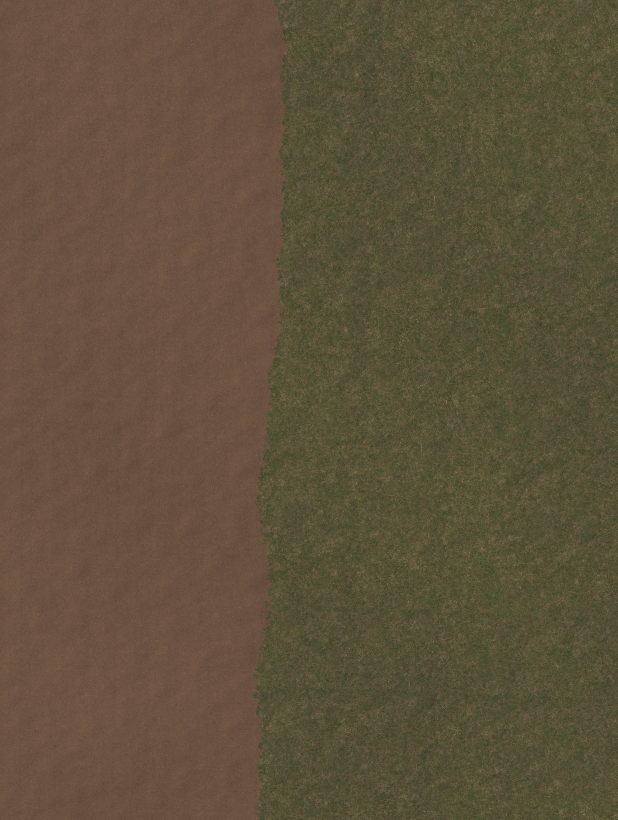
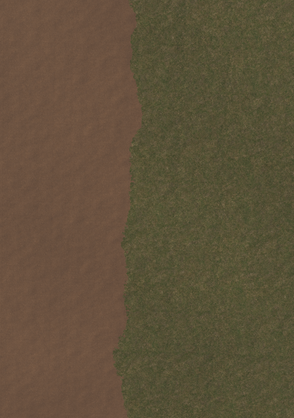

# Terrain Boundary Naturalizer

The Terrain Boundary Naturalizer reshapes existing boundaries between painted
Terrain Layers. It replaces straight or mechanically noisy edges with a
controllable, natural-looking outline while preserving the terrain height,
detail painting, tree placement, and height-blend configuration.

| Before | After |
| --- | --- |
|  |  |

## Requirements

- A `TerrainSurfaceGroup` containing the terrain tiles to edit.
- At least two Terrain Layers on every tile.
- The same Terrain Layer count and order on every tile in the group.
- A `TerrainCollider` on each tile that should receive Scene view input.

The tool works directly on standard Unity alphamaps. It does not require a
runtime component and it can process a stroke across adjacent terrain tiles.

## Workflow

1. Open **Tools > Terrain Tools > Terrain Boundary Naturalizer**.
2. Assign a Terrain Surface Group, or select a terrain in the group and click
   **Use Selected Terrain or Group**.
3. Choose **Auto** to affect the dominant material boundary under the brush,
   or **Selected Pair** to restrict the stroke to two Terrain Layers.
4. Choose **Clean** for one continuous edge or **Islands** to add small pieces
   of one selected material beyond the main boundary.
5. Adjust the feature sizes and displacement strengths, then enable Scene view
   naturalization.
6. Drag the left mouse button over an existing material boundary and release
   it to apply the stroke.

Hold Alt while using the left mouse button to navigate the Scene view. One
complete drag is recorded as one Undo operation.

## Controls

| Setting | Effect |
| --- | --- |
| Layer Scope | `Auto` follows whichever two layers dominate locally. `Selected Pair` changes only the chosen pair. |
| Character | `Clean` removes detached fragments. `Islands` can add deliberate material islands near the boundary. |
| Edge Contrast | Narrows the weight transition between the dominant pair without changing the boundary shape. |
| Feature Size | Sets the world-space scale of the large, medium, or small noise band. |
| Displacement | Sets how far that noise band can move the sampled boundary. |
| Island Size | Controls the approximate radius of generated islands. |
| Island Reach | Controls how far islands can appear from the original boundary. |
| Island Amount | Controls the density of eligible islands. |
| Brush Diameter | Sets the world-space width of the Scene view brush. |
| Soft Edge | Fades the effect near the brush edge. |
| Seed | Produces a repeatable world-space noise pattern. |

## Editing behavior

The tool reads a padded alphamap area around the stroke so its noise and island
sampling remain continuous at tile seams. It writes only the smallest changed
alphamap rectangle on each affected tile. Cancelling during calculation leaves
the TerrainData unchanged, and errors roll the full stroke back through Unity's
Undo system.
