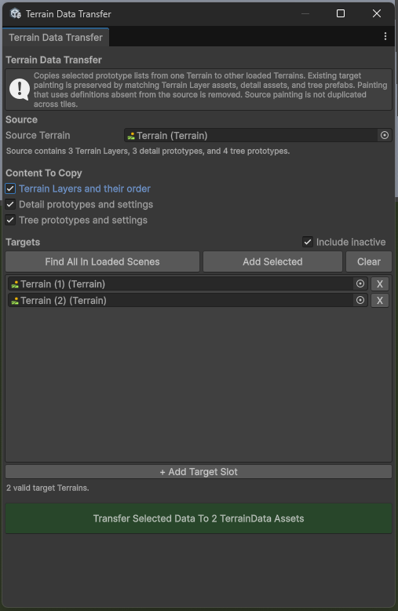

# Terrain Data Transfer

Open the window from:

`Tools > Terrain Tools > Terrain Data Transfer`

Use this tool when several Terrain tiles should share one authoritative list
and order of:

- Terrain Layers
- Detail prototypes and their settings
- Tree prototypes and their settings

## Workflow

1. Assign the authoritative Terrain as **Source Terrain**.
2. Select the content categories to copy.
3. Populate the target list with **Find All In Loaded Scenes**, **Add
   Selected**, or manual object slots.
4. Review the number of unique target TerrainData assets.
5. Click **Transfer Selected Data** and confirm the operation.

Inactive Terrain objects can be included during automatic discovery. Terrain
components that share one TerrainData asset are listed separately but the
shared asset is modified only once. The source TerrainData is always excluded
from the target set.

## Painting preservation

The transfer replaces selected definition lists and keeps compatible painting
already present on each target:

- Alphamap channels are matched by the referenced Terrain Layer asset.
- Detail maps are matched by their prefab or texture asset.
- Tree instances are matched by their prefab asset.

Matching is occurrence-based, so repeated references retain their relative
occurrence order. The mapped data is moved to the source list order. Alphamap
weights are normalized after channels that no longer exist are removed. A
pixel with no remaining compatible layer is assigned fully to the first source
layer.

Painting associated with a definition that is missing from the source is
removed. New source definitions start empty on the target. The source
Terrain's own alphamaps, detail maps, and tree positions are not copied.

The complete operation is grouped into one Unity Undo action. TerrainData
assets are saved after a successful transfer, and an error rolls back the
entire operation.
