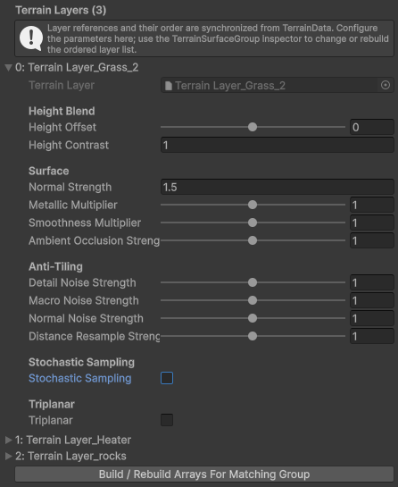
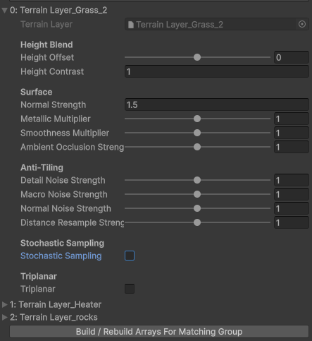
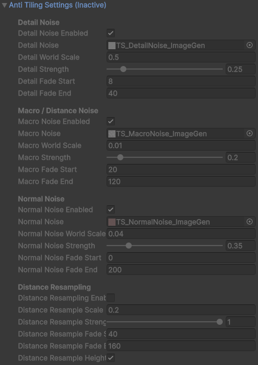
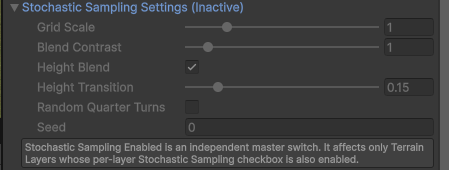
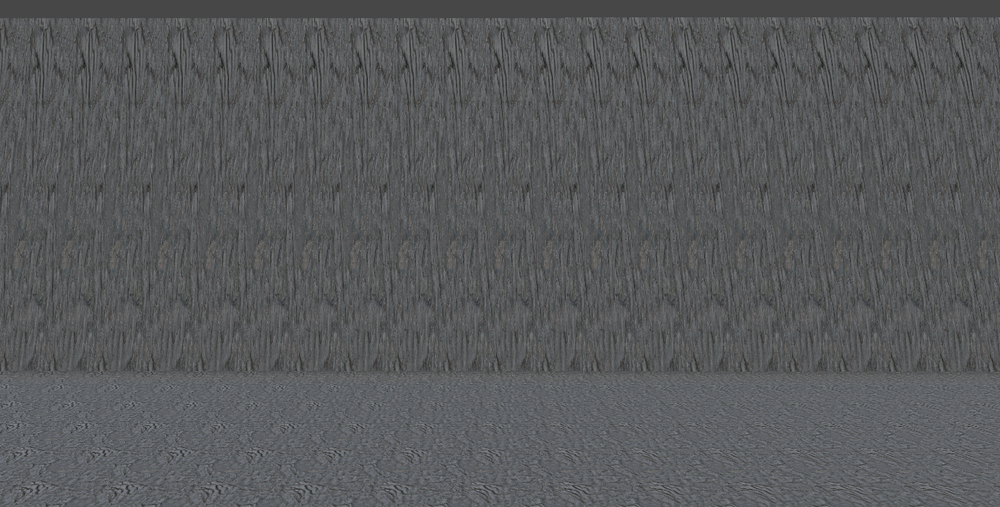
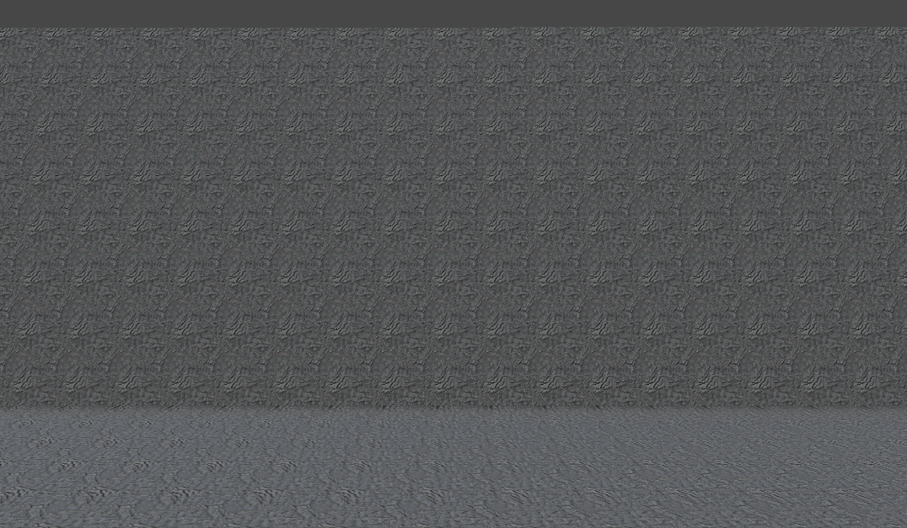
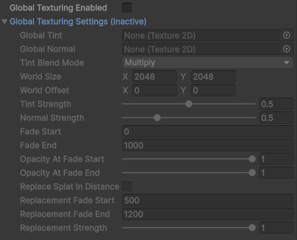

# Terrain Surface System

## Purpose

Terrain Surface System replaces the standard Terrain material with a URP
Forward+ shader that renders up to 20 TerrainLayers while evaluating only the
strongest two, three, or four layers per pixel.

## Profile options

| Profile-wide rendering controls | Synchronized per-layer controls |
| --- | --- |
|  |  |

*The profile separates shared rendering quality from settings that are tuned for
each synchronized TerrainLayer.*

### Blending

- **Height Blend Enabled** uses the packed height channel when combining the
  selected layers.
- **Blend Quality** selects Top2, Top3, or Top4. Higher values preserve more
  subtle painted mixtures at a higher sampling cost.
- **Height Transition**, **Global Height Offset**, and **Global Height Contrast**
  shape the height-aware transition.
- Per-layer height offset and contrast tune individual materials.

*Each layer can override surface response and opt into the expensive sampling
features independently.*

### Surface data

The array builder creates:

- BC7 albedo RGB + height A;
- BC7 encoded normal XY + occlusion + smoothness;
- BC4 metallic.

Per-layer normal, metallic, smoothness, and ambient-occlusion multipliers are
applied without rebuilding source TerrainLayer assets.

Each synchronized layer also exposes **Tint Enabled** and **Tint**. This tint is
applied in the shader after sampling the albedo array and before the selected
layers are combined. It changes only runtime profile parameters, so enabling it
or adjusting its color does not rebuild texture arrays, regenerate alphamaps or
control maps, modify TerrainData, or require repainting the terrain. Existing
generated arrays remain valid.

Rebuild the arrays only when data baked into them changes, such as source
TerrainLayer textures or their packed surface values.

### Anti-tiling

Detail noise, macro noise, and normal noise have independent world scales,
strengths, distance fades, and per-layer multipliers. Distance resampling takes a
second texture-set sample at another scale and can use height-aware blending.

*Anti-tiling modules have independent world scales and distance ranges. Their
profile-wide master switch must be enabled before these settings affect rendering.*

### Stochastic sampling

The profile-wide master switch activates triangle-grid stochastic sampling.
Each layer can opt out. Grid scale, contrast, height-aware stochastic blending,
quarter-turn rotation, and seed are configurable.

*Stochastic sampling is enabled globally and then opted into per TerrainLayer.*

### Triplanar

Triplanar projection is enabled per layer and exposes scale, projection
sharpness, and height transition. Use it selectively on steep cliff materials;
it evaluates three projections. Smooth terrain blends those projections using
the geometric normal and layer height. Top and side projections use a hard
boundary derived from the rasterized terrain surface, so a cliff projection
cannot leak onto the adjacent floor. Higher projection sharpness biases that
boundary toward the top projection, reserving side projection for steeper
geometry. Side-facing X/Z projections can still blend with each other.

| Planar projection on a cliff | Triplanar projection enabled |
| --- | --- |
|  |  |

*Triplanar projection removes the severe vertical stretching visible on steep
heightfield walls. Enable it selectively because every active layer evaluates
three projections which leads to higher performance cost, hovewer when enabled
only for selected number of layers, its negligible.*

### Global texturing

A world-space tint and normal can break up large-scale repetition. Tint modes
are Multiply, Overlay, and CrossFade. Distance replacement can gradually replace
splat albedo with the global tint.

*Global texturing provides a terrain-wide world-space layer for large-distance
variation and optional distant splat replacement.*

## Procedural baker

Open **Tools > Terrain Tools > Terrain Surface > Procedural Baker**.

Rules target TerrainLayer assets and can combine world height, slope,
cavity/ridge response, fractal world-space noise, and a world-region texture
mask. Higher-priority rules claim weight first; the configured fallback layer
receives the remainder.

**Generate Preview** is non-destructive. **Bake All Terrain Tiles** stores a
compressed alphamap backup before applying results. Restore from the window or
from the generated backup inspector. Cancelled or failed work does not leave a
partial bake applied.

The baker has no player runtime cost. Authoring time scales with output width ×
height × tile count × enabled rule work.

## Mesh blending

Add `Terrain Surface Mesh Blend` to a Renderer at a terrain intersection, assign
the Terrain Surface Group, and click **Create Mesh Blend Material** followed by
**Synchronize Terrain Tiles**.

Controls include blend distance, terrain height offset, falloff, terrain-normal
blend, optional vertex-alpha masking, and world-space blend noise. Up to four
overlapping terrain tiles are bound to one mesh renderer.

Mesh blending is a runtime shader feature and has a real per-pixel cost. Keep
blend meshes spatially tight and avoid using the material on large surfaces that
do not intersect terrain.
