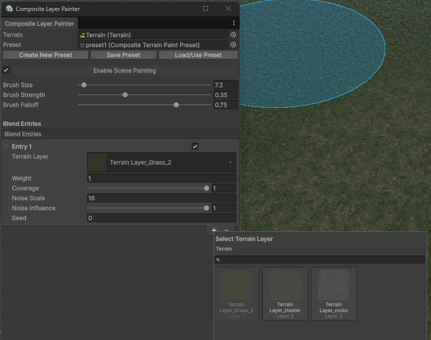

# Terrain Tools

Terrain Tools is a Unity 6 URP package for building large, varied terrains
without fighting the limitations of the standard Terrain workflow. It combines
a terrain material that can height-blend up to 20 layers with practical Scene
view tools for painting ground, vegetation, trees, and terrain shapes.

The main feature is the surface shader. Unity's standard height-based blending
is limited to four Terrain Layers, which quickly becomes restrictive when one
terrain needs grass, soil, mud, rock, gravel, paths, cliffs, and regional
variations. Terrain Tools keeps height-based transitions across as many as 20
layers, so materials meet along their natural edges instead of looking like
soft opacity blends.

The package also fills several gaps in Unity's built-in terrain authoring
tools. You can paint a mix of several tree prefabs with a chosen percentage
distribution, scatter multiple detail types as one preset, paint reusable
mixtures of ground layers, and shape slopes or field furrows with dedicated
brushes. The result is less repetitive manual work and more consistent terrain
across a larger world.

This is a personal tool built around my own production needs and workflow.

> **Screenshot asset notice:** Screenshots in this repository show example
> Terrain Layers, detail prototypes, tree prefabs, and environment assets.
> These assets are used only to demonstrate the tools and are not included or
> redistributed with this package.

## What it adds

### Natural blending for up to 20 terrain layers

The custom terrain material supports height-based blending across up to 20
Terrain Layers. It uses the height stored in each material to decide how
surfaces overlap, producing more believable transitions between materials such
as stones and soil or grass and mud.

You can balance visual quality and rendering cost by evaluating the strongest
two, three, or four layers at each pixel. Optional features help keep large
terrains varied and readable, including anti-tiling, stochastic sampling,
large-scale color and normal variation, distance texturing, and triplanar
projection for steep cliffs.

### Paint several ground materials at once

The **Composite Layer Painter** turns a group of Terrain Layers into one
reusable brush preset. For example, a single stroke can paint a grass, soil, and
small-stone mixture instead of requiring three separate passes. Each material
can have its own proportion, coverage, and noise variation, while the tool keeps
the final layer weights correctly normalized.

### Paint varied groups of trees

The **Tree Preset Painter** lets one brush place several tree prefabs according
to a percentage-based distribution. A forest preset might contain mostly pine,
some birch, and a small number of dead trees, with separate random scale and
rotation settings for every type.

Density and minimum spacing controls make it useful for both loose natural
scatter and more controlled placement. Trees remain native Unity
`TreeInstance` data, so the tool does not add a custom runtime vegetation
system.

### Paint mixed grass, plants, and other details

The **Detail Preset Painter** does the same kind of grouped painting for Unity
Terrain details. One preset can combine several grass textures, flowers,
stones, or detail prefabs, each with its own density share, coverage, and noise
pattern. The brush follows the Terrain under the cursor, which makes it easier
to work across a tiled landscape.

### Shape terrain with purpose-built brushes

The **Relative Height Brush** creates shapes that are awkward to build with
Unity's standard raise, lower, and smooth tools. It includes circles, squares,
straight and curve-controlled slopes, repeated field furrows, and individual
furrows. A live Scene view preview shows the target surface before it is
applied, and the brush can work continuously across adjacent Terrain tiles.

### Generate terrain layers from landscape rules

The **Procedural Baker** can distribute materials using world height, slope,
cavities and ridges, world-space noise, and region masks. It is useful for
creating a first pass over a large terrain or keeping neighboring tiles
consistent. You can preview the result before changing the Terrain, and a
backup is created before a full bake so the previous alphamaps can be restored.

### Blend meshes into the terrain

The package can blend meshes such as rocks, paths, or cliff pieces into the
surrounding terrain material. This softens the visible seam where an object
intersects the ground and lets the mesh inherit nearby terrain color and
normal detail.

## Workflow and runtime

All painting and procedural generation happens in the Unity Editor. These tools
write standard Unity Terrain data and do not require painter components in a
build. Each brush stroke is recorded as one Undo operation, and painting errors
restore the state from before the stroke.

The terrain surface material and optional terrain-to-mesh blending are runtime
rendering features. Expensive surface options are disabled by default and can be
enabled only for the layers that need them.

## Compatibility

| Requirement | Supported configuration |
| --- | --- |
| Unity | `6000.4.0f1` |
| Render pipeline | URP `17.4.0`, Forward+ |
| Platform | Windows, DirectX 11 or DirectX 12 |
| Shader model | 4.5 |
| Texture arrays | BC7 albedo/height and normal/surface, BC4 metallic |

## Documentation

- [Terrain Surface System](Documentation~/terrain-surface-system.md)
- [Composite Layer Painter](Documentation~/composite-layer-painter.md)
- [Tree Preset Painter](Documentation~/tree-preset-painter.md)
- [Detail Preset Painter](Documentation~/detail-preset-painter.md)
- [Relative Height Brush](Documentation~/relative-height-brush.md)
- [Performance](Documentation~/performance.md)
- [Architecture](Documentation~/architecture.md)
