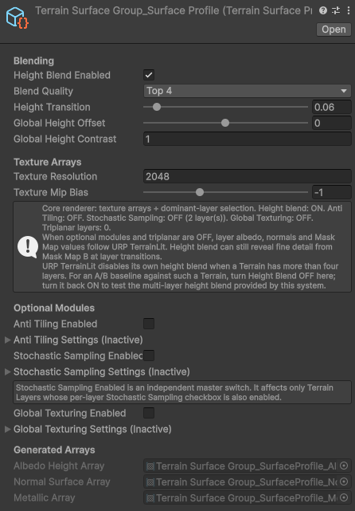
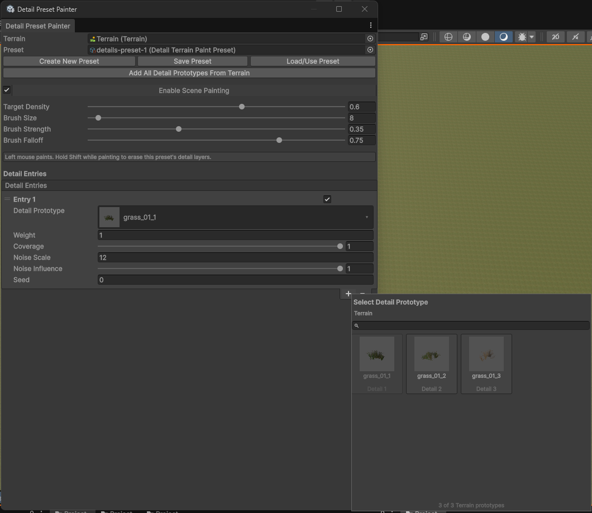
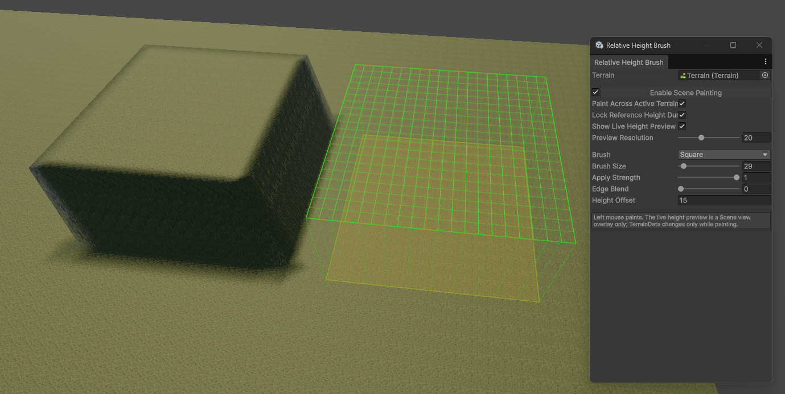
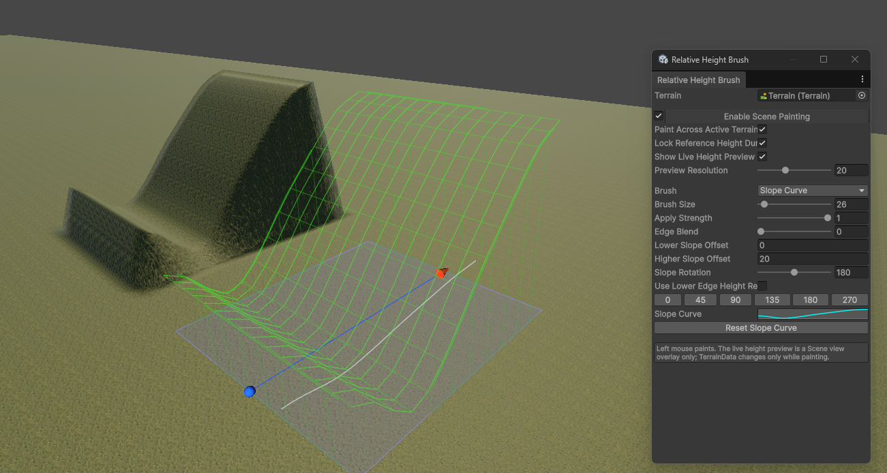
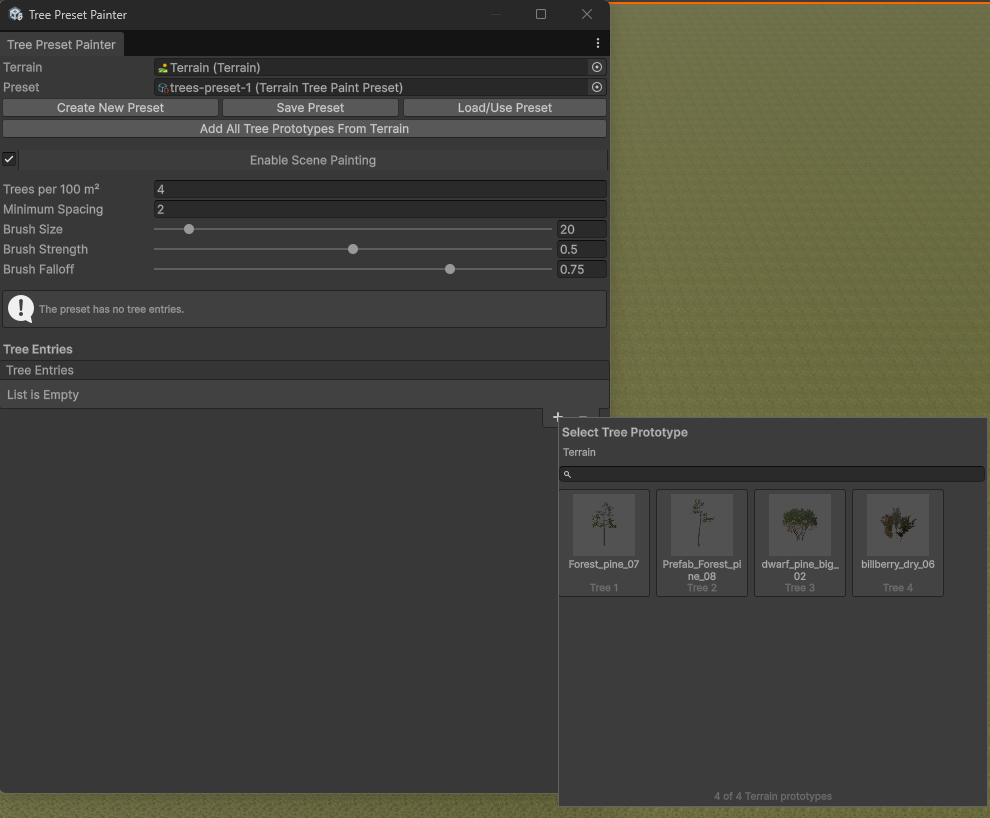
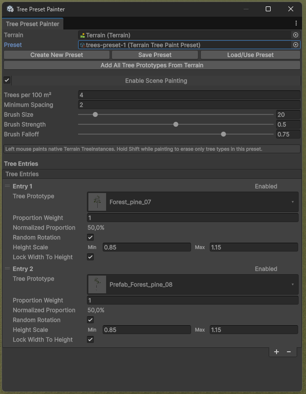

# Terrain Tools

Terrain Tools is a production-oriented Unity package for authoring and rendering
large URP terrains. It combines a custom 20-layer terrain surface shader,
procedural alphamap baking, terrain-to-mesh blending, and four focused Scene
view painters. This is my personal tool tailored for my needs.

> **Screenshot asset notice:** Screenshots in this repository show example Terrain Layers, detail prototypes, tree prefabs, and environment assets. These assets are shown only to demonstrate the tools and are not included or redistributed with this package. Terrain Tools provides the tool implementation.

## Compatibility

| Requirement | Supported configuration |
| --- | --- |
| Unity | `6000.4.0f1` |
| Render pipeline | URP `17.4.0`, Forward+ |
| Platform | Windows, DirectX 11 or DirectX 12 |
| Shader model | 4.5 |
| Texture arrays | BC7 albedo/height and normal/surface, BC4 metallic |

## Quick start

1. Select one or more Terrain objects.
2. Run **Tools > Terrain Tools > Terrain Surface > Create Group From Selected Terrains**.
3. On the new `Terrain Surface Group`, click **Create Profile + Material**.
4. Click **Synchronize Layers**, then **Build / Rebuild Texture Arrays**.
5. Click **Apply Profile To Terrain Group**.
6. Open a painter from **Tools > Terrain Tools > Painters** when authoring
   splat layers, details, trees, or relative height.

Generated profiles, materials, backups, previews, and texture arrays are written
under `Assets/Generated/TerrainTools`. The installed package is never used as a
generated-data destination.

## Included tools

- **Terrain Surface System** — up to 20 layers; Top2/Top3/Top4 selection; height
  blending; anti-tiling; stochastic sampling; global texturing; triplanar
  projection; procedural bake/restore; and terrain-aware mesh blending.

- **Composite Layer Painter** — paints a normalized, noise-modulated mixture of
  TerrainLayer assets on one selected Terrain. Entries are chosen from a
  searchable thumbnail grid populated by that Terrain.
- **Detail Preset Painter** — paints or erases weighted detail prefab/texture
  presets and follows the Terrain under the cursor. Its picker exposes only
  detail prototypes registered on the selected Terrain.

- **Relative Height Brush** — circle, square, linear slope, curve slope, field
  furrows, and single-furrow shapes with live height preview.

- **Tree Preset Painter** — paints weighted native `TreeInstance` presets with
  scale, rotation, density, erase, and minimum-spacing controls, using visual
  prefab selection from the Terrain's tree prototypes.

Tree and Detail presets store asset references rather than Terrain prototype
indices. A missing or ambiguous mapping blocks painting with a specific error.
There is no index fallback.

## Design constraints

- Painters and procedural baking run only in the Unity Editor and add no player
  runtime cost.
- A stroke is one Undo operation. An exception during painting reverts the
  active stroke.
- Composite painting stays attached to its selected Terrain. Tree and Detail
  painters switch to the Terrain under the cursor. Relative Height optionally
  paints across all active Terrains.
- The three bundled noise textures are assigned to new Terrain Surface profiles,
  but optional rendering modules remain disabled until explicitly enabled.

## Documentation

- [Installation and setup](Documentation~/installation.md)
- [Architecture](Documentation~/architecture.md)
- [Performance](Documentation~/performance.md)
- [Terrain Surface System](Documentation~/terrain-surface-system.md)
- [Composite Layer Painter](Documentation~/composite-layer-painter.md)
- [Detail Preset Painter](Documentation~/detail-preset-painter.md)
- [Relative Height Brush](Documentation~/relative-height-brush.md)
- [Tree Preset Painter](Documentation~/tree-preset-painter.md)
